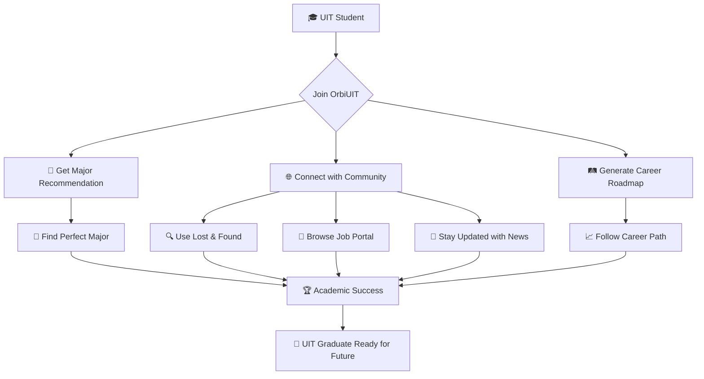

# 🌟 OrbiUIT
<div align="center">

```
   ╔══════════════════════════════════════════════════════════════╗
   ║                                                              ║
   ║    ██████╗ ██████╗ ██████╗ ██╗██╗   ██╗██╗████████╗          ║
   ║   ██╔═══██╗██╔══██╗██╔══██╗██║██║   ██║██║╚══██╔══╝          ║
   ║   ██║   ██║██████╔╝██████╔╝██║██║   ██║██║   ██║             ║
   ║   ██║   ██║██╔══██╗██╔══██╗██║██║   ██║██║   ██║             ║
   ║   ╚██████╔╝██║  ██║██████╔╝██║╚██████╔╝██║   ██║             ║
   ║    ╚═════╝ ╚═╝  ╚═╝╚═════╝ ╚═╝ ╚═════╝ ╚═╝   ╚═╝             ║
   ║                                                              ║
   ║              🎓 The Ultimate UIT Student Universe            ║
   ║                                                              ║
   ╚══════════════════════════════════════════════════════════════╝
```

<p align="center">
  
</p>

<p align="center">
  
  
  
</p>

<p align="center">
  
  
  
  
</p>

---


</div>

## 🔮 What is OrbiUIT?

> **The future of student collaboration is here.** OrbiUIT isn't just another platform — it's the digital nexus where UIT students **connect**, **learn**, and **thrive** together.

<div align="center">
<table>
<tr>
<td width="50%">

```ascii
    🧭 CAREER GUIDANCE
    ┌─────────────────┐
    │   🎯 Majors     │
    │   🛤️ Roadmaps   │
    │   🧠 AI Guide   │
    │   💡 Insights   │
    └─────────────────┘
```

</td>
<td width="50%">

```ascii
    🌐 SOCIAL NETWORK
    ┌─────────────────┐
    │   🔍 Lost/Found │
    │   📰 News       │
    │   💼 Jobs       │
    │   🎉 Events     │
    └─────────────────┘
```

</td>
</tr>
</table>
</div>

---

## ⚡ What We Offer

<div align="center">

| 🎯 **CORE FEATURES** | 🌐 **SOCIAL NETWORK** |
|:---:|:---:|
|  |  |
|  |  |
|  |  |

</div>

### 🎪 **The Experience**



---

## 🛠️ **Tech Arsenal**

<div align="center">

### 🎨 **Frontend Magic**


### ⚙️ **Backend Power**


### 🔧 **DevOps & Tools**


</div>

---

## 🎯 **Quick Start**

```bash
# 🚀 Clone the universe
git clone https://github.com/your-username/orbiuit.git

# 📦 Install dependencies
cd orbiuit
npm install

# 🔥 Launch into orbit
npm start

# 🌟 Access at localhost:3000
```

---


---

## 🌈 **Contributing to the Revolution**

<div align="center">

```
┌─────────────────── CONTRIBUTION FLOW ───────────────────┐
│                                                         │
│  🍴 Fork  →  🔧 Code  →  🧪 Test  →  📝 PR  →  🎉 Merge │
│                                                         │
└─────────────────────────────────────────────────────────┘
```

</div>

**Ready to make OrbiUIT even more awesome?**

1. **🍴 Fork** this repository
2. **🌟 Create** your feature branch (`git checkout -b feature/AmazingFeature`)
3. **💖 Commit** your changes (`git commit -m 'Add some AmazingFeature'`)
4. **🚀 Push** to the branch (`git push origin feature/AmazingFeature`)
5. **🎯 Open** a Pull Request

---

## 🎊 **Join the Community**

<div align="center">

<a href="https://discord.gg/orbiuit">
  
</a>
<a href="https://facebook.com/orbiuit">
  
</a>
<a href="https://instagram.com/orbiuit">
  
</a>

</div>

---

<div align="center">


```
╔═══════════════════════════════════════════════════════════════╗
║                                                               ║
║   🌟 "Connecting UIT Students, One Orbit at a Time" 🌟       ║
║                                                               ║
║               Made with 💜 by UIT Students                    ║
║                    © 2025 OrbiUIT                             ║
║                                                               ║
╚═══════════════════════════════════════════════════════════════╝
```

<p align="center">
  
</p>

</div>
